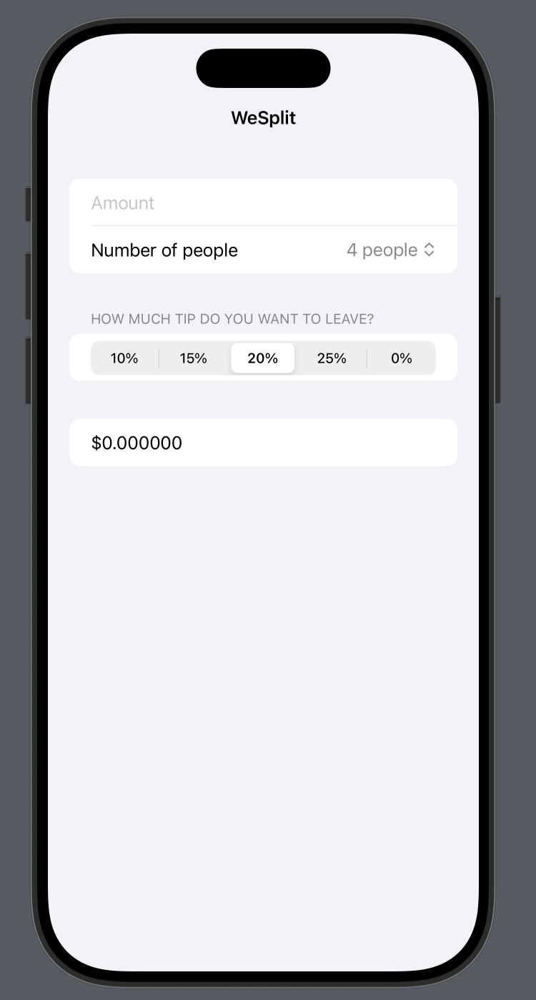

# WeSplit

WeSplit is a simple yet functional iOS application built using Swift and SwiftUI. The app helps users calculate the amount each person needs to pay when splitting a bill, including tips. It's a user-friendly solution for quick and accurate bill splitting among friends or family.

## Features
- **Bill Splitting:** Automatically calculates the amount each person owes, including tips.
- **Customizable Tip Percentages:** Choose from pre-defined tip percentages (10%, 15%, 20%, 25%, or no tip).
- **Dynamic People Count:** Adjust the number of people splitting the bill using an intuitive picker.
- **Real-Time Calculations:** Updates the split amount dynamically as input values are adjusted.
- **Elegant UI:** Designed using SwiftUI for a seamless and responsive user experience.

## Preview



## Technologies Used
- **Language:** Swift
- **Framework:** SwiftUI
- **Development Tools:** Xcode

## Getting Started
### Prerequisites
- macOS with Xcode installed
- iOS device or simulator running iOS 13 or later

### Installation
1. Clone the repository:
   ```bash
   git clone https://github.com/yourusername/WeSplit.git

2. Open the project in Xcode:
   ```bash
   open WeSplit.xcodeproj

3. Build and run the app on your simulator or iOS device.

### Usage
1. Enter the bill amount in the text field.
2. Select the number of people splitting the bill.
3. Choose the desired tip percentage.
4. View the calculated amount each person needs to pay.

### License
This project is licensed under the MIT License. Feel free to use and modify it as needed.
